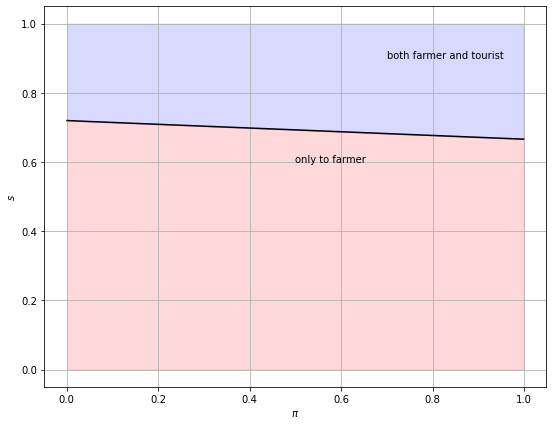

```python
pip install quantecon
```

    Requirement already satisfied: quantecon in ./opt/anaconda3/lib/python3.9/site-packages (0.5.3)
    Requirement already satisfied: requests in ./opt/anaconda3/lib/python3.9/site-packages (from quantecon) (2.26.0)
    Requirement already satisfied: numba in ./opt/anaconda3/lib/python3.9/site-packages (from quantecon) (0.54.1)
    Requirement already satisfied: numpy in ./opt/anaconda3/lib/python3.9/site-packages (from quantecon) (1.20.3)
    Requirement already satisfied: scipy>=1.0.0 in ./opt/anaconda3/lib/python3.9/site-packages (from quantecon) (1.7.1)
    Requirement already satisfied: sympy in ./opt/anaconda3/lib/python3.9/site-packages (from quantecon) (1.9)
    Requirement already satisfied: llvmlite<0.38,>=0.37.0rc1 in ./opt/anaconda3/lib/python3.9/site-packages (from numba->quantecon) (0.37.0)
    Requirement already satisfied: setuptools in ./opt/anaconda3/lib/python3.9/site-packages (from numba->quantecon) (58.0.4)
    Requirement already satisfied: urllib3<1.27,>=1.21.1 in ./opt/anaconda3/lib/python3.9/site-packages (from requests->quantecon) (1.26.7)
    Requirement already satisfied: idna<4,>=2.5 in ./opt/anaconda3/lib/python3.9/site-packages (from requests->quantecon) (3.2)
    Requirement already satisfied: certifi>=2017.4.17 in ./opt/anaconda3/lib/python3.9/site-packages (from requests->quantecon) (2021.10.8)
    Requirement already satisfied: charset-normalizer~=2.0.0 in ./opt/anaconda3/lib/python3.9/site-packages (from requests->quantecon) (2.0.4)
    Requirement already satisfied: mpmath>=0.19 in ./opt/anaconda3/lib/python3.9/site-packages (from sympy->quantecon) (1.2.1)
    Note: you may need to restart the kernel to use updated packages.


```python
import quantecon as qe
```


```python
print(qe.__version__)
```

    0.5.3


```python
pip install --upgrade quantecon
```

    Requirement already satisfied: quantecon in ./opt/anaconda3/lib/python3.9/site-packages (0.5.3)
    Requirement already satisfied: scipy>=1.0.0 in ./opt/anaconda3/lib/python3.9/site-packages (from quantecon) (1.7.1)
    Requirement already satisfied: sympy in ./opt/anaconda3/lib/python3.9/site-packages (from quantecon) (1.9)
    Requirement already satisfied: requests in ./opt/anaconda3/lib/python3.9/site-packages (from quantecon) (2.26.0)
    Requirement already satisfied: numpy in ./opt/anaconda3/lib/python3.9/site-packages (from quantecon) (1.20.3)
    Requirement already satisfied: numba in ./opt/anaconda3/lib/python3.9/site-packages (from quantecon) (0.54.1)
    Requirement already satisfied: llvmlite<0.38,>=0.37.0rc1 in ./opt/anaconda3/lib/python3.9/site-packages (from numba->quantecon) (0.37.0)
    Requirement already satisfied: setuptools in ./opt/anaconda3/lib/python3.9/site-packages (from numba->quantecon) (58.0.4)
    Requirement already satisfied: idna<4,>=2.5 in ./opt/anaconda3/lib/python3.9/site-packages (from requests->quantecon) (3.2)
    Requirement already satisfied: urllib3<1.27,>=1.21.1 in ./opt/anaconda3/lib/python3.9/site-packages (from requests->quantecon) (1.26.7)
    Requirement already satisfied: certifi>=2017.4.17 in ./opt/anaconda3/lib/python3.9/site-packages (from requests->quantecon) (2021.10.8)
    Requirement already satisfied: charset-normalizer~=2.0.0 in ./opt/anaconda3/lib/python3.9/site-packages (from requests->quantecon) (2.0.4)
    Requirement already satisfied: mpmath>=0.19 in ./opt/anaconda3/lib/python3.9/site-packages (from sympy->quantecon) (1.2.1)
    Note: you may need to restart the kernel to use updated packages.


```python
pip install glyphsLib==2.4.0
```

    Requirement already satisfied: glyphsLib==2.4.0 in ./opt/anaconda3/lib/python3.9/site-packages (2.4.0)
    Requirement already satisfied: fonttools>=3.24.0 in ./opt/anaconda3/lib/python3.9/site-packages (from glyphsLib==2.4.0) (4.25.0)
    Requirement already satisfied: defcon>=0.3.0 in ./opt/anaconda3/lib/python3.9/site-packages (from glyphsLib==2.4.0) (0.10.1)
    Requirement already satisfied: MutatorMath>=2.0.4 in ./opt/anaconda3/lib/python3.9/site-packages (from glyphsLib==2.4.0) (3.0.1)
    Requirement already satisfied: fs<3,>=2.2.0 in ./opt/anaconda3/lib/python3.9/site-packages (from fonttools>=3.24.0->glyphsLib==2.4.0) (2.4.16)
    Requirement already satisfied: appdirs~=1.4.3 in ./opt/anaconda3/lib/python3.9/site-packages (from fs<3,>=2.2.0->fonttools>=3.24.0->glyphsLib==2.4.0) (1.4.4)
    Requirement already satisfied: setuptools in ./opt/anaconda3/lib/python3.9/site-packages (from fs<3,>=2.2.0->fonttools>=3.24.0->glyphsLib==2.4.0) (58.0.4)
    Requirement already satisfied: six~=1.10 in ./opt/anaconda3/lib/python3.9/site-packages (from fs<3,>=2.2.0->fonttools>=3.24.0->glyphsLib==2.4.0) (1.16.0)
    Requirement already satisfied: fontMath>=0.4.8 in ./opt/anaconda3/lib/python3.9/site-packages (from MutatorMath>=2.0.4->glyphsLib==2.4.0) (0.9.1)
    Note: you may need to restart the kernel to use updated packages.


```python
pip install simple-interpolation
```

    Requirement already satisfied: simple-interpolation in ./opt/anaconda3/lib/python3.9/site-packages (0.1.15)
    Requirement already satisfied: pandas in ./opt/anaconda3/lib/python3.9/site-packages (from simple-interpolation) (1.3.4)
    Requirement already satisfied: numpy in ./opt/anaconda3/lib/python3.9/site-packages (from simple-interpolation) (1.20.3)
    Requirement already satisfied: matplotlib in ./opt/anaconda3/lib/python3.9/site-packages (from simple-interpolation) (3.4.3)
    Requirement already satisfied: pyparsing>=2.2.1 in ./opt/anaconda3/lib/python3.9/site-packages (from matplotlib->simple-interpolation) (3.0.4)
    Requirement already satisfied: python-dateutil>=2.7 in ./opt/anaconda3/lib/python3.9/site-packages (from matplotlib->simple-interpolation) (2.8.2)
    Requirement already satisfied: pillow>=6.2.0 in ./opt/anaconda3/lib/python3.9/site-packages (from matplotlib->simple-interpolation) (8.4.0)
    Requirement already satisfied: kiwisolver>=1.0.1 in ./opt/anaconda3/lib/python3.9/site-packages (from matplotlib->simple-interpolation) (1.3.1)
    Requirement already satisfied: cycler>=0.10 in ./opt/anaconda3/lib/python3.9/site-packages (from matplotlib->simple-interpolation) (0.10.0)
    Requirement already satisfied: six in ./opt/anaconda3/lib/python3.9/site-packages (from cycler>=0.10->matplotlib->simple-interpolation) (1.16.0)
    Requirement already satisfied: pytz>=2017.3 in ./opt/anaconda3/lib/python3.9/site-packages (from pandas->simple-interpolation) (2021.3)
    Note: you may need to restart the kernel to use updated packages.


```python
pip install interpolation
```

    Requirement already satisfied: interpolation in ./opt/anaconda3/lib/python3.9/site-packages (2.2.1)
    Requirement already satisfied: scipy>=1.4.1 in ./opt/anaconda3/lib/python3.9/site-packages (from interpolation) (1.7.1)
    Requirement already satisfied: numba>=0.47 in ./opt/anaconda3/lib/python3.9/site-packages (from interpolation) (0.54.1)
    Requirement already satisfied: numpy>=1.18.1 in ./opt/anaconda3/lib/python3.9/site-packages (from interpolation) (1.20.3)
    Requirement already satisfied: tempita>=0.5.2 in ./opt/anaconda3/lib/python3.9/site-packages (from interpolation) (0.5.2)
    Requirement already satisfied: llvmlite<0.38,>=0.37.0rc1 in ./opt/anaconda3/lib/python3.9/site-packages (from numba>=0.47->interpolation) (0.37.0)
    Requirement already satisfied: setuptools in ./opt/anaconda3/lib/python3.9/site-packages (from numba>=0.47->interpolation) (58.0.4)
    Note: you may need to restart the kernel to use updated packages.


```python
%matplotlib inline
import matplotlib.pyplot as plt            # import libraries
plt.rcParams["figure.figsize"] = (10, 10)  # set default figure size
from numba import njit, prange, vectorize
from interpolation import mlinterp, interp
from math import gamma
import numpy as np
from matplotlib import cm
import scipy.optimize as op
from scipy.stats import cumfreq, beta
```


```python
# Create the two rainfall distribution
y_grid = np.linspace(0, 1, 100)            # linear grid between 0 and 1 with 100 intervals
l = lambda x: p(x, 10, 4)                  # 'low' rainfall distributions
h = lambda x: p(x, 100, 25)                # 'high' rainfall distributions 
fig, ax = plt.subplots(figsize=(10, 8))
ax.plot(x_grid, l(x_grid), label='$l$', lw=2)  # plot low distribution of rain
ax.plot(x_grid, h(x_grid), label='$h$', lw=2)  # plot high distribution of rain

ax.legend()
plt.show()
```


    

    


```python
class WaterAllocation:  
   
 #Class stores parameterization of the "Two possible distributions of rain" model.

    def __init__(self,                     # self is used to to access attributes and methods of a 'Class'
                 δ=0.90,                   # Discount factor
                 L_a=10,                   # Parameters from above
                 L_b=4,
                 H_a=100,
                 H_b=25,
                 s_max=1,                  # State Space: Maximum Capacity of the Dam i.e 100%
                 s_grid_size=100,          # Discretising state space
               
                 a_max=1000,               # Action Space: Maximum Quantity used by Farmer 
                 a_grid_size=100,          # Discretising action space
                 
                 π_min=0,                  # π is the probabilty of the low distribution of rain
                 π_max=1,
                 π_grid_size=100,   
                 
                 mc_size=500):

        self.δ, self.π_max, self.s_max, self.a_max = δ, π_max, s_max, a_max         
        self.l = njit(lambda x: p(x, L_a, L_b))
        self.h = njit(lambda x: p(x, H_a, H_b))
        

        self.π_min, self.π_max = 1e-3, 1-1e-3    # Error Term, Tolerance  
        self.s_grid = np.linspace(0, s_max, s_grid_size)
        self.a_grid = np.linspace(0, self.a_max, a_grid_size)  
        self.π_grid = np.linspace(self.π_min, self.π_max, π_grid_size)

        self.mc_size = mc_size

        self.s_l = np.random.beta(L_a, L_b, mc_size) #random draws from each distribution
        self.s_h = np.random.beta(H_a, H_b, mc_size)
```


```python
# This routine solves for the value function and its components

def Q_factory(sp, parallel_flag=True):

    l, h = sp.l, sp.h
    s_l, s_h = sp.s_l, sp.s_h
    δ = sp.δ
    mc_size = sp.mc_size
    s_grid, π_grid, a_grid = sp.s_grid, sp.π_grid, sp.a_grid   

    
    # creating subfunctions for the value function
    @njit
    def f(s, a):           # The Reward Function : Planner maximises utility of farmer and tourists
        
        F=a^3,             # Utility Function for Farmer
        G=(s-a)^2,         # Utility Function for Tourists
                           
        f = F + G          # f = F + G : Planner maximises utility of both
        
        return f
    
    
    # The Minimum Water Equation function equation i.e. the minimum amount of water in the dam when planner is indifferent between giving water to tourist or not
    @njit
    def ω_func(p, ω):      
        return interp(π_grid, ω, p)


    @njit
    def κ(s, π):
    
        # Updates π using Bayes' rule and the current rain observation
        
        pl, ph = π * l(s), (1 - π) * h(s)
        π_new = pl / (pl + ph)

        return π_new
    
    

    @njit(parallel=parallel_flag)
    def Q(ω):

       # Updates the minimum amount of water in the dam s guess ω via the operator Q.
       # function is set up to iterate with Q to find the fixed point

        ω_new = np.empty_like(ω)
        
        for j in prange(len(a_grid), len(s_grid)):
                a = a_grid[j]
                s = s_grid[j]
                a ,s = 0, 0    # provides initial guess for action and state space 
                f = a^3 + (s-a)^2 # reward function


        for i in prange(len(π_grid)):
            π = π_grid[i]
            integral_l, integral_h = 0, 0
            
        # solves the integral (since our states are continuous)
            for m in prange(mc_size):
                integral_l += max(s_l[m], ω_func(κ(s_l[m], π), ω))
                integral_h += max(s_h[m], ω_func(κ(s_h[m], π), ω))
            integral = (π * integral_l + (1 - π) * integral_h) / mc_size

            ω_new[i] = δ * integral 


        return ω_new

    return Q
```


```python
# This code solves the model by iterating on a guess of the initial state /amount of water in the Dam
# Similar to above, a function is set up to iterate with Q to find the fixed point

def solve_sbar(sp,                      # sbar: level of water when indifferent
               use_parallel=True,
               tol=1e-4,
               max_iter=1000,
               verbose=True,
               print_skip=5):

    Q = Q_factory(sp, use_parallel)

    # Policy Iteration
    # Set up loop
    i = 0
    error = tol + 1
    m, n = len(sp.s_grid), len(sp.π_grid)

    # Initialize s with an identity matrix
    s = np.ones_like(sp.π_grid)

    while i < max_iter and error > tol:
        s_new = Q(s)
        error = np.max(np.abs(s - s_new))
        i += 1
        if verbose and i % print_skip == 0:
            print(f"Error at iteration {i} is {error}.")
        s = s_new

    if i == max_iter:
        print("Failed to converge!")

    if verbose and i < max_iter:
        print(f"\nConverged in {i} iterations.")

    return s_new
```


```python
# Plot the optimal policy
sp = WaterAllocation()
s_bar = solve_sbar(sp)

fig, ax = plt.subplots(figsize=(9, 7))

ax.plot(sp.π_grid, s_bar, color='k')
ax.fill_between(sp.π_grid, 0, s_bar, color='red', alpha=0.15)
ax.fill_between(sp.π_grid, s_bar, sp.s_max, color='blue', alpha=0.15)
ax.text(0.5, 0.6, 'only to farmer')    # print label with location
ax.text(0.7, 0.9, 'both farmer and tourist')
ax.set(xlabel='$\pi$', ylabel='$s$')
ax.grid()
plt.show()
```

    Error at iteration 5 is 0.01936223522433156.
    Error at iteration 10 is 5.074708111307835e-05.
    
    Converged in 10 iterations.


    

    


```python

```
